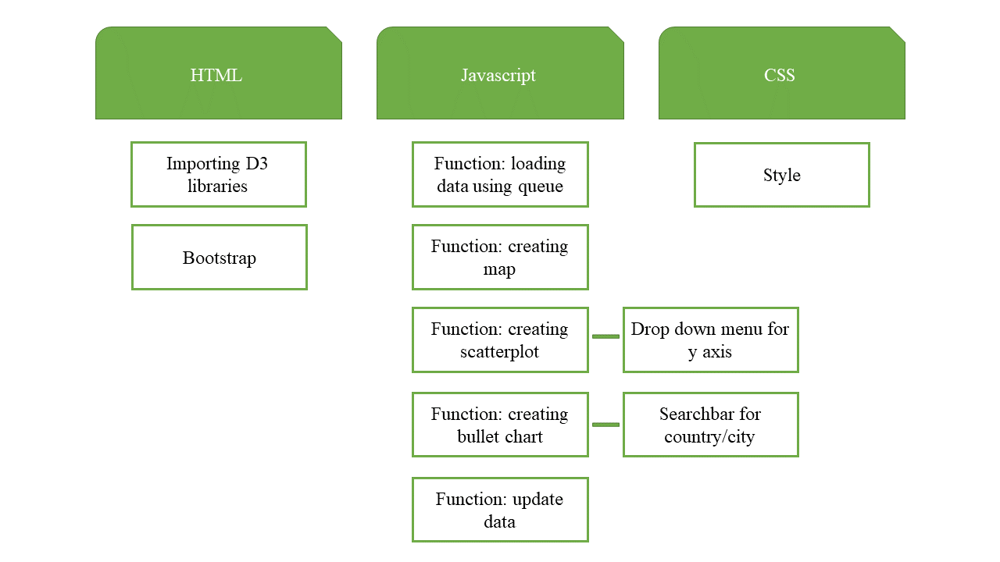

# author

Pernille Deijlen
10747354

# design

## data sources
Ik ga data gebruiken van eurostat, de database van de Europese Unie en van de OECD database. Deze data heb ik gefilterd op de variabelen die ik nodig ga hebben, op Europese hoofdsteden en voor de jaren 2008 tm 2014. Waarschijnljik, omdat niet alle data voor elk jaar beschikbaar is, gebruik ik alleen het jaar 2014. Ik heb al mijn data als CSV bestand gedownload en zal alles gaan omzetten naar JSON bestanden om deze vervolgens in te kunnen laden.
-	[eurostat](http://ec.europa.eu/eurostat/data/database)
-	[OECD](https://data.oecd.org/)

## diagram

## description
Als eerste zal in in mijn javascript file mijn data inladen. Vervolgens maak ik een functie voor het maken van de map van Europa (choropleth). Als het lukt wil ik graag een stip toevoegen op de locatie van de hoofdstad. De kleuren op de map duiden van licht naar donker de hoeveelheid geboren kinderen aan. Wanneer je erover hovert licht het land op en komt de titel van het land, de hoofstad en het aantal geboren kinderen in dat jaar in beeld. Deze map heb ik bij een eerdere opdracht al gemaakt en kan ik hier dus goed bij gebruiken.

Naast de map komt meteen de scatterplot in beeld, hier zal ik ook een functie voor maken. Hierbij zie je op de x-as het aantal geboren kinderen en voor de y-as komt er een drop down menu voor het kiezen van de variabele. Je kunt kiezen voor de grootte (in km2) of voor het aantal inwoners van de stad. Ik moet dus zorgen dat de scatterplot update voor deze twee variabelen. De kleuren van de steden in de scatterplot komen overeen met de kleuren op de map. Bij het hoveren over de map wordt de bijbehorende stip in de scatterplot iets groter.

Vervolgens maak ik een functie voor de bullet chart. Hierbij geef ik informatie weer over de steden op gebied van educatie, economie, environment en de life satisfaction rate. Hierbij is ook het gemiddelde van alle steden zichtbaar. Via een zoekbalk kan de gebruiker een land of een stad intypen waarvan vervolgens data van wordt weergegeven. De bullet chart moet dus telkens updaten met de gekozen stad/land.

Als de data het toe laat zou ik de visualaties graag voor meerdere jaren laten zien. Ik zou dan een slider op de pagina kunnen plaatsen waarmee een jaar gekozen kan worden, hier worden dan de map en de scatterplot op gebaseerd. En als gevolg ook de bullet chart.

## list
Ik zal d3 libraries nodig hebben voor de visualisaties en d3.queue voor de functies.

## examples
-	Hieronder een voorbeeld van een map van Europa die ik voor een vorige opdracht al heb gemaakt.

-	[scatterplot](http://bl.ocks.org/weiglemc/6185069)
-	[bullet chart](https://bl.ocks.org/mbostock/4061961)

