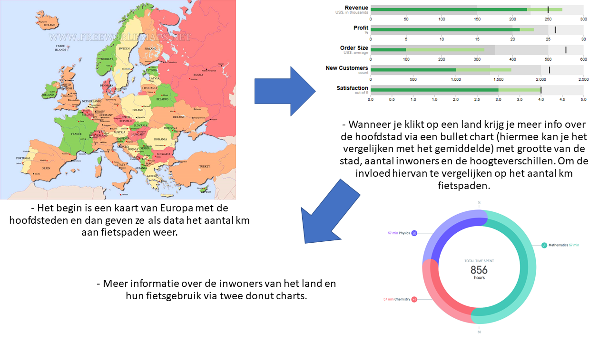

# author

Pernille Deijlen
10747354

[Pages](https://pernilledeijlen.github.io/Project/)

# project proposal
Mijn visualisaties zullen informatie over het aantal geboortes laten zien van hoofdsteden van Europa. Veel mensen weten waarschijnlijk niet hoe dit in vergelijking staat tot onze eigen hoofdstad Amsterdam. Op deze manier hoop ik hier een idee over te geven. Verder zal ik meer informatie geven over de steden, deze variabelen zijn eventueel van invloed op het aantal geboortes. 

## sketch

## features
Je begint met een kaart van Europa met de hoofdsteden en hierbij het aantal geboortes (waarschijnlijk voor 1 jaar aangezien de data niet anders toelaat). Hiernaast staat meteen een scatterplot, hier staat op de x-as het aantal geboortes, en op de y-as kun je zelf via een drop down menu de variable kiezen. Je kunt hierbij kiezen uit de grootte van de stad (in km2) en het aantal inwoners (en misschien ook de median age). Wanneer je over landen hovert op de map merk je dit ook op de scatterplot en andersom. Vervolgens kan er op een land/stad geklikt worden op de map of bij de legenda van de scatterplot. Er verschijnt dan een bullet chart met bij de titel de naam van de stad en het aantal geboortes vs het gemiddelde aantal geboortes en in de chart verdere informatie per stad zoals educatie, environment, economie en criminaliteit. Hierbij zie je ook het gemiddelde van alle landen zodat je kunt vergelijken.

Naast het interactieve element bij de scatterplot wil ik ook graag een een knop maken waarbij je van "thema" kan veranderen (misschien te moeilijk). Of een knop waarbij je meer informatie kan vinden over de variabelen in de visualisaties (hoe ze gedefinieerd zijn).

## data sources
Op dit moment heb ik voor alle hoofdsteden data gevonden over geboortes, educatie, environment, populatie, grootte in km2, quality of life (per land), happy planet index ( per land), criminaliteit, economie en een life satisfaction rate.

De data komt van Eurostat, OECD en happy planet index.

## external components
D3 library

## review other visualisations
Er zijn kaarten beschikbaar met aantal geboortes maar niet die verder ingaan op eventuele invloeden hiervan.

## hard parts
Het tot een logisch / goed verhaal te vormen en niet losse visulatisaties.

