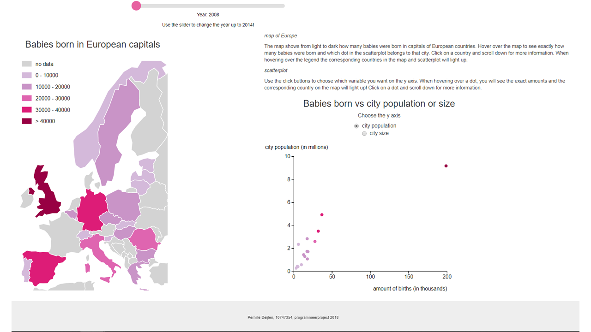

# author

Pernille Deijlen
10747354

[Mijn project](https://pernilledeijlen.github.io/Project/)

# project: babies in Europe

## purpose and screenshots
Het doel van deze pagina is om de verschillen van het aantal geboortes tussen hoofdsteden van Europa te laten zien en welke variabelen hier eventueel invloed op hebben. Als eerste zie je de kaart van Europa gebaseerd op het aantal geboren babies in het default jaar 2008 en daarnaast de scatterplot die dit aantal geboren babies uitgetzet tegen de grootte en de populatie van de stad.

Je kunt via de slider het jaar aanpassen en de y-as van de scatterplot veranderen door de andere box te selecteren. Wanneer je bijvoorbeeld over de legenda hovert zie je de bijbehorende landen in de kaart en op de scatterplot.

Wanneer je klikt op een land op de kaart of op een land van de scatterplot komt de bulletchart te voorschijn met meer informatie.

## copyright
De algemene voorwaarden voor gebruik, reproductie en distributie van de code zijn te vinden in LICENSE.

-	D3 - Released under the BSD 3-Clause "New" or "Revised" License and Copyright 2010-2017 Mike Bostock.
-	D3 datamaps - Released under the MIT License and Copyright (c) 2012 Mark DiMarco.
-	D3 bullet - Released under the GNU General Public License and Copyright (c) 2018 Mike Bostock.
-	Bootstrap - Released under the MIT license, Copyright (c) 2011-2018 Twitter, Inc and Copyright (c) 2011-2018 The Bootstrap Authors.

