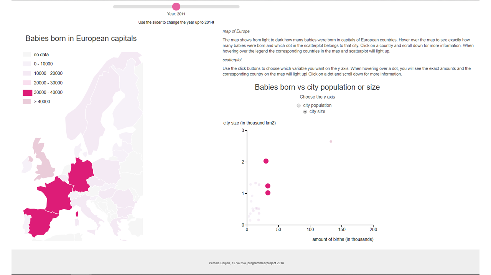
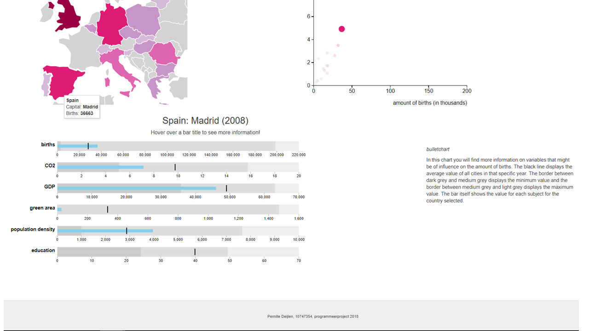

# author

Pernille Deijlen
10747354

[Mijn project](https://pernilledeijlen.github.io/Project/)

# project: babies in Europe

## purpose
Het doel van deze pagina is om de verschillen tussen hoofdsteden van Europa te laten zien. Als eerste zie je de kaart van Europa gebaseerd op het aantal geboren babies in het gekozen jaar van de slider en daarnaast de scatterplot die dit aantal geboren babies uitzet tegen de grootte en de populatie van de stad.

## copyright
De algemene voorwaarden voor gebruik, reproductie en distributie van de code zijn te vinden in LICENSE.

-	D3 - Copyright 2010-2017 Mike Bostock
-	D3 tip - Copyright (c) 2013 Justin Palmer
-	D3 datamaps - Copyright (c) 2012 Mark DiMarco
-	D3 bullet - Copyright (c) 2018 Mike Bostock
-	Bootstrap - Copyright (c) 2011-2018 Twitter, Inc and Copyright (c) 2011-2018 The Bootstrap Authors

