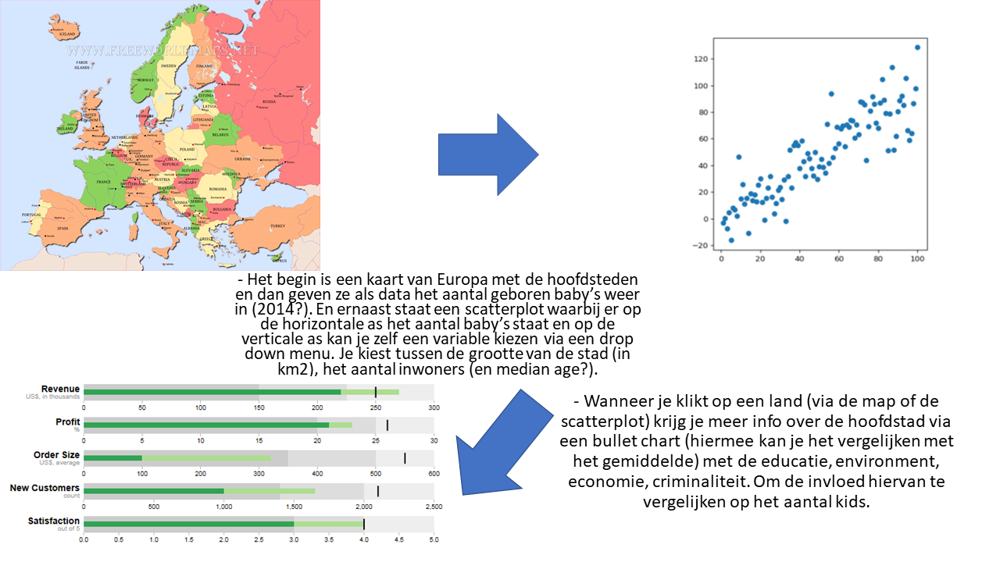

# author

Pernille Deijlen
10747354

[Mijn project](https://pernilledeijlen.github.io/Project/)

# current state project

## screenshots
<!--  -->

## features
XXXXXX

## data sources
De data komt van Eurostat en de OCED:
-	[eurostat](http://ec.europa.eu/eurostat/data/database)
-	[OECD](https://data.oecd.org/)

