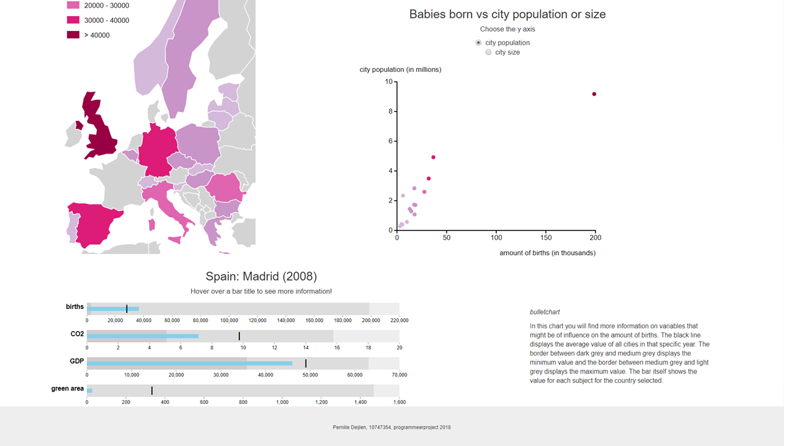

# author

Pernille Deijlen
10747354

# project: babies in Europe

## description
Het doel van deze pagina is om de verschillen van het aantal geboortes tussen hoofdsteden van Europa te laten zien en welke variabelen hier eventueel invloed op hebben.

## screenshot

## technical design
Mijn javascript files:
-	**data.js**				laden en verwerken van de data
-	**map.js** 				maken van de kaart
-	**scatter.js** 			maken van de scatterplot
-	**bulletchart.js** 		maken van de bulletchart
-	**update.js** 			visualisaties updaten met slider en tickboxes 
-	**interactivity.js** 	interactiviteit binnen en tussen visualisaties

De data bestaat uit vier CSV files die ik heb omgezet naar JSON files. Deze worden vervolgens via een queue ingeladen in **data.js**. Hier heb ik globale data arrays gemaakt zodat ik hier altijd bij kan komen. Als eerste wordt de data voor de map verwerkt in de functie *dataMap()*. Hier gebruik ik data over het aantal geboortes per jaar per stad. Deze verwerk ik een een dictionary met hierbij de naam van de stad, de value en de fillcolor. Aangezien Londen, Engeland bijna elk jaar een grote outlier was binnen de data, heb ik besloten zelf de schaal voor de fillcolors te bepalen. Op deze manier kan ik wel genoeg verschil tussen de steden/landen laten zien. Hier wordt dan de kaart voor 2008 (default) gemaakt via de functie *makeMap()*. Vervolgens wordt de data voor de scatterplot verwerkt in dataScatter(). Aangezien ik op de y-as twee variabelen heb, heb ik besloten twee data arrays te gebruiken. In beide vind je eerst het aantal geboortes, dan de populatie of grootte, landcode, land en als laatst de stad. Vervolgens wordt de scatterplot voor 2008 en op de y-as populatie gemaakt via *makeScatter()*. Hier na wordt ook *updateSlider()* aangeroepen zodat de kaart en scatterplot updaten. Als laatste in data.js wordt de data voor de bulletchart verwerkt in *dataBulletchart()*. Deze bevat voor elk jaar en stad het aantal geboortes, CO2 uitstoot, GDP, green area, population density en education. Ook is er een data array die alle data per onderwerp voor elk jaar bevat. Zodat hiermee maximum voor alle jaren en steden bepaald kan worden.

In **map.js** staan de functies *makeMap()* waar de kaart gemaakt wordt en de functie *updateMap()* waar deze wordt geupdate. Ik heb een globale variable map zodat beide functies hierbij kunnen. In *makeMap()* wordt gezorgd dat de map is "ingezoomd" op Europa. Ook is er een tooltip gemaakt die het land, de hoofdstad en de exacte waarde weergeeft. Hier worden ook de functies *mouseOverMapScatter()* en *mouseOutMapScatter()* aangeroepen. In de functie *updateMap()* wordt er nieuwe data meegegeven van het jaar van de slider en wordt de map opnieuw ingekleurd met kleuren gebaseerd op de nieuwe values.

In **scatter.js** staan ook twee functies, *makeScatter()* en *updateScatter()*. Bij het maken van de scatterplot wordt eerst de maximum value voor alle jaren bepaald voor de x-as, het aantal geboortes, en de y-as, de populatie. Dit doe ik zodat de waarden van de assen altijd hetzelfde blijven, en je door de jaren heen beter kan vergelijken. Vervolgens kun je met de slider het jaar aanpassen, en met de tickbox een andere y-as kiezen. De scatterplot wordt vervolgens aangepast met *updateScatter()*, deze functie krijgt dan de juiste data mee. Hier wordt ook de maximum bepaalt voor alle jaren voor de grootte, zodat deze as ook altijd hetzelfde blijft. In beide functies worden ook *mouseOverScatter()* en *mouseOutScatter()* aangeroepen wanneer er over een stip gehoverd wordt.

In **bulletchart.js** ook drie functies. De eerste is voor het klaarmaken van de data, *dataMakeBulletchart()*. In deze functie wordt de data van het juiste jaar en de juiste stad meegegeven. Hierin wordt eerst het minimum, maximum en gemiddelde berekend voor alle steden voor dat jaar. Deze wordt gebruikt in de bulletchart voor de achtergrond kleuren en het zwarte streepje. De maximum range wordt berekend over alle jaren en alle steden, zodat deze altijd vast staat. Vervolgens wordt er een dictionary gemaakt met alle waarden die nodig zijn voor het maken van de bulletchart. Er wordt gecheckt of er uberhaupt data is over het aantal geboorten, zo nee, komt er in beeld te staan dat er geen data beschikbaar is. Zo ja, wordt er vervolgens eerst gecheckt of er al een bulletchart stond, zo nee, wordt de functie *makeBulletchart()* aangeroepen en wordt de data meegegeven. Als er al een bulletchart stond wordt de functie *updateBulletchart()* aangeroepen en wordt ook de data meegegeven. In *makeBulletchart()* wordt als eerst informatie toegevoegd over de visualisatie. Vervolgens wordt er een titel en subtitel toegevoegd en dan de bulletchart zelf. Ook worden de functies *mouseOverBullet()* en *mouseOutBullet()* aangeroepen. In *updateBulletchart()* wordt de bulletchart geupdate. De titel wordt aangepast met het geselecteerde land, stad en jaar en vervolgens worden de values van de bulletchart aangepast. Ook hier worden de functies *mouseOverBullet()* en *mouseOutBullet()* aangeroepen.

Veranderingen door het aanpassen van de slider of door een andere y-as te kiezen worden verwerkt in **update.js**. Het aanpassen van de slider gaat via *updateSlider()*. Als eerste heb je het default jaar, 2008. Wanneer de y-as hier wordt aangepast, wordt de functie *updateRadio()* aangeroepen. Ook wordt de bulletchart gemaakt wanneer er op de kaart wordt geklikt, *clickMapBullet()*, of wanneer er op een stip wordt geklikt, *clickScatterBullet()*. Wanneer de slider wordt aangepast wordt de functie *updateMap()* aangeroepen en wordt het jaar meegegeven zodat de juiste data geselecteerd kan worden. Ook wordt er gekeken welke y-as er geselecteerd is bij de scatterplot, en wordt vervolgens *updateScatter()* aangeroepen en wordt er data voor het huidige jaar en voor de geselecteerde y-as meegegeven. Ook wordt *updateRadio()* weer aangeroepen, zodat als iemand de y-as verandert, de scatterplot update voor het huidige jaar. Wanneer de bulletchart er al stond, wordt er gezorgd dat deze ook mee update met het huidige jaar via *dataMakeBulletchart()*. Je geeft de juist data en het huidige jaar mee aan deze functie. Vervolgens worden ook nog de functies *clickMapBullet()* en *clickScatterBullet()* aangeroepen zodat deze wanneer er geklikt wordt op de kaart of op een stip de bulletchart update voor het huidige jaar.

In **interactivity.js** staan alle functies voor interactiviteit binnen en tussen visualisaties. De functies staan geordend op visualisatie, eerst de kaart en legenda, dan de scatterplot en als laatste de bulletchart. *mouseOverLegendMap()* en *mouseOutLegendMap()* zorgen ervoor dat er wanneer er over de legenda gehovert wordt, de landen met dezelfde kleur naar voren komen op de kaart. Ook de functies *mouseOverScatterMap()* en *mouseOutScatterMap()* laten de juiste landen naar voren komen wanneer je over een sitp hovert. Wanneer er over de legenda wordt gehoverd, wordt de legendapunt groter en alle andere worden lichter, dit gebeurt via *mouseOverLegend()* en *mouseOutLegend()*. Hierin worden ook de functies *mouseOverLegendMap()*, *mouseOverLegendScatter()*, *mouseOutLegendMap()* en *mouseOutLegendScatter()* aangeroepen.
Voor de scatterplot zijn er ook meerdere interactiviteits functies. Als eerst de functies *mouseOverScatter()* en *mouseOutScatter()*. Deze zorgen ervoor dat de stip waar over gehoverd wordt groter wordt en alle andere stippen lichter. Ook komt er een tooltip tekst in beeld die het land, de stad en de exacte waarden weergeeft. Hierin worden ook *mouseOverScatterMap()* en *mouseOutScatterMap()* in aangeroepen. In de functies *mouseOverMapScatter()* en *mouseOutMapScatter()* wordt er gezorgd dat de juiste stip in de scatterplot naar voren komt wanneer je over een land hovert op de kaart. Als laatste de functies *mouseOverLegendScatter()* en *mouseOutLegendScatter()*. Deze functies zorgen ervoor dat wanneer je over de legenda hovert, de stippen met dezelfde kleur naar voren komen.
Voor de bulletchart zijn er twee "on-click" functies en een tooltip functie. De functies *clickMapBullet()* en *clickScatterBullet()* zorgen ervoor dat er een bulletchart gemaakt wordt voor het land op de kaart of de stip van de scatterplot waar op is geklikt. De functies *mouseOverBullet()* en *mouseOutBullet()* zorgen voor de tooltip wanneer er over een bar titel wordt gehoverd. Er komt dan onder de titel van de bulletchart in beeld wat de exacte waarde is en de bijbehorende eenheid en grootheid.

## challenges and decisions
Een deel van de uitdagingen en beslissingen heb ik hierboven al uitgelegd. Ik zal hieronder even terugblikken op mijn proposal. Mijn eindpagina lijkt best wel op mijn idee in mijn PROPOSAL.md. Ik wilde beginnen met de kaart van Europa met het aantal geboorten en ernaast een scatterplot. Ik twijfelde toen nog over het aantal jaar dat ik wilde gaan gebruiken. Uiteindelijk heb ik ervoor gekozen om de jaren 2008 tot 2014 te nemen aangezien de data voor deze jaren het meest compleet was. Via de eurostat database kon ik niet verder terug dan 2008 en na 2014 ontbraken er veel datapunten. In eerste instantie wilde ik een dropdown menu maken voor de y-as van de scatterplot. Dit heb ik gewijzigd in een "radio". Ook heb ik alleen de keuze tussen city population en city size, en niet median age. Deze data was namelijk erg incompleet. Aangezien ik in mijn proposal dacht dat ik alleen voor 1 jaar aan data zou gebruiken, wilde ik als extra html element een zoekbalk toevoegen waar je een land/stad intypt die dan vervolgens de bulletchart liet zien. Achteraf bleek dus dat ik wel meerdere jaren kon doen, waardoor ik een slider heb gebruikt in plaats van deze zoekbalk. Je kunt via het klikken op een land op de kaart of een stip op de scatterplot bij de bulletchart komen. In mijn proposal wilde ik een dropdown menu voor meer uitleg over de variabelen. Achteraf bleek dit onnodig. Op de assen van de scatterplot en in de tooltip van de bulletchart staan de definities duidelijk uitgelegd. Ook de knop voor het wisselen van "thema" was een extra optie die ik niet heb uitgevoerd.

Als ik meer tijd zou hebben dan had ik graag de pagina zelf mooier gemaakt. Nu lag de focus vooral op alles werkend krijgen en genoeg uitleg zodat mensen snappen wat er mogelijk is. Graag had ik misschien een achtergrond toegevoegd. De titels van de visualisaties en de uitlegteksten mooier gemaakt. Ook zou ik meer data willen zoeken om de database completer te krijgen. Nu mist er af en toe data voor een land.